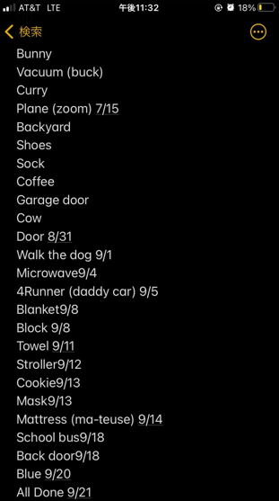
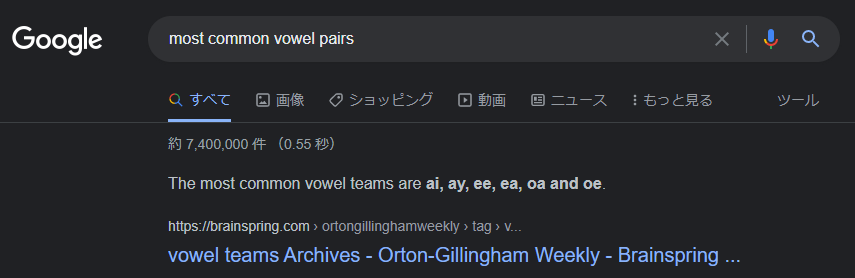

# Stage 0 - Data Collection Process
This data was collected for 1 year after my son said his first word unprompted
(i.e. nothing was counted that comes after "Can you say...")

I counted anything regardless of pronunciation if I knew what he meant

This was done on the default iPhone notes app.
At first, I wasn't consistently collecting date, but later I did
Sometimes I put a note as to his pronunciation such as`Mattress`=*ma-teuse*
or context clarity, i.e. `Button`=*Garage Door Clicker*
So we'll have a little bit of cleanup to do


# Stage 1 - Data Processing
Every Project in the real world starts with data cleaning

Start off with pulling in the data and seeing what we got

```{r}
library(readxl)
Raw_Data <- read_excel("Raw Data.xlsx", col_types = c("text","text"))
```
```{r}
head(Raw_Data,4)
tail(Raw_Data,4)
```

Looks like there's still dates in there. So I'll remove any `-` `/` or  `0-9`
```{r,results='hide', include=FALSE}
library(dplyr)
library(stringr)
```
```{r}
df<-Raw_Data%>%
  mutate(Word=str_replace_all(Word,'[0-9]|/|-',""))
head(df,4)
tail(df,4)
```

Okay so the **Word** field is cleaned up. It's just words now

Now let's get the date into a date format so that we can sort it correctly
```{r}
df<-df%>%
  mutate(Date=as.Date(Date,"%m/%d/%Y"))
head(df,5)
tail(df,5)
```

Awesome, everything is formatted right. 

But looks like I didn't track all
dates at the start. Let's fill those with `na.approx` from the `zoo` package
```{r,results='hide', include=FALSE}
library(zoo)
```
```{r}
df<-df%>%mutate(Date=as.Date(na.approx(df$Date, na.rm = FALSE)))
head(df,5)
```

Nice, comparing that `head` output to the previous one shows the interpolation
worked great

Now let's see what insights we can get from our data

# Stage 2 - Growth Spurts
Now the fun part
First let's group and summarize the data by month
```{r,results='hide', include=FALSE}
library(ggplot2)
library(lubridate)
```
```{r, warning=FALSE}

df.month<-df%>%
  mutate(Date_Month=floor_date(Date,"months"))%>%
  group_by(Date_Month)%>%
  summarize(Count=n())
df.month
```

Now let's see what it looks like on the plot!
```{r}
ggplot(df.month, aes(x=Date_Month,y=Count)) +
  geom_bar(stat='identity', fill="steelblue")+
  geom_text(aes(label=Count), vjust=-0.3, size=3.5)+
  ggtitle("Words Learned By Month")+
  theme_minimal()
```

Wow, we saw a big surge centered around January 2021

Let's put that in terms of how old he was so it's more relatable 
He was born December 2021
```{r}
df.month<-df.month%>%
  mutate(Months_Old=interval(ymd(as.Date("2018-12-01"))
                             ,ymd(Date_Month)) %/% months(1))

xlim_max.months_old<-max(df.month$Months_Old,na.rm = TRUE)+1
xlim_min.months_old<-min(df.month$Months_Old,na.rm = TRUE)-1
```

And now let's plot it again, this time RED!
```{r}
ggplot(df.month, aes(x=Months_Old,y=Count)) +
  geom_bar(stat='identity', fill="red")+
  geom_text(aes(label=Count), vjust=-0.3, size=3.5)+
  ggtitle("Words Learned By Month")+
  theme_minimal() +
  scale_x_continuous(limits=c(xlim_min.months_old,xlim_max.months_old))
```

So that big surge was right after the 2nd birthday, interesting!

# Stage 3 - Simple Words First

Now, let's test the theory that simpler words are learned younger

Let's say that "simple" means less syllables

I devised a dirty way to count that by counting all the vowels (using regex)
and then subtracting out the most common vowel pairs which are...


I'll make a function to county syllables
```{r}
word<-"sasqouthanbeek"

count_syllables<-function(word) {
  str_count(word,'[a,e,i,o,u]')-
  str_count(word,'ai')-
  str_count(word,'ay')-
  str_count(word,'ee')-
  str_count(word,'ea')-
  str_count(word,'oa ')-
  str_count(word,'ou')-
  str_count(word,'oe')
}

count_syllables(word)
```

Perfect, it counts each vowel, then subtracts 1 for each pair.
(It's much harder to do that all in regex)

By the way, If you have to ask what's `sasqouthanbeek` then you won't get it

Let's apply that function to our data to count the syllables in each word
(gotta put `Word` in lowercase since my function is looking for lowercase)
```{r}
df_syllable<-df%>%
  mutate(SyllableCount=count_syllables(tolower(Word)))
head(df_syllable)
tail(df_syllable)
```
Okay, there are some problems here
* Some words have `[]` and `()`
* Some words have 0 syllables (let's set those to 1)

On the other hand, it worked really well for words like `Triangle`
where it counted 2 syllables even though it has a pair of vowels.
It did that correctly because `ia` isn't in the top 7 pairs I got from Google

Let's tackle the first issue
```{r warning=FALSE}
df_syllable<-df_syllable%>%
  mutate(loc_bracket = str_locate( Word,c('\\['))[,'start'])%>%
  mutate(loc_parentheses = str_locate( Word,c('\\('))[,'start'])%>%
  rowwise()%>%
  mutate(loc_first=case_when(is.na(loc_bracket)==FALSE |
                               is.na(loc_parentheses)==FALSE ~
    min(c(loc_bracket,loc_parentheses),na.rm = TRUE)))%>%
  mutate(Word_cleaned=case_when(is.na(loc_first)==TRUE~Word
                          ,TRUE~substr(Word,1,loc_first-1)))%>%
  select(-loc_bracket,-loc_parentheses)

print(df_syllable%>%filter(is.na(loc_first)==FALSE)%>%tail())
```

Awesome, `Word_cleaned` will be a lot better to get `SyllableCount` from

Let's do that; and if anything turns up to be 0, we'll set it to 1.
That'll give us the correct result for things like `[phone] died` above

```{r}
df_syllable<-df_syllable%>%
  mutate(SyllableCount=count_syllables(tolower(Word_cleaned)))%>%
  mutate(SyllableCount=case_when(SyllableCount==0 ~ as.integer(1)
                                 , TRUE ~ SyllableCount ))

print(df_syllable%>%filter(is.na(loc_first)==FALSE)%>%tail())
```

Very Nice! Syllable Counts are pretty good now.

Now let's use them to find out if "simpler" (less syllables) words learned first

We'll do that by grouping by month again
```{r}
df_syllable.month<-df_syllable%>%
  mutate(Date_Month=floor_date(Date,"months"))%>%
  group_by(Date_Month)%>%
  summarize(SyllableCount_Avg=mean(SyllableCount))

model_lm<-lm(df_syllable.month$SyllableCount_Avg ~ df_syllable.month$Date_Month)
summary(model_lm)  
```
```{r}
plot(df_syllable.month$Date_Month, 
     df_syllable.month$SyllableCount_Avg,
     pch = 16)
abline(model_lm,col = 4, lwd = 3)
```

Slightly positive slope, but not a very good fit, so I don't think we can say
conclusively that simpler (less syllables) words are learned earlier,
at least for this sample data set