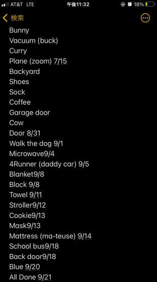

Son’s First Words Project
================


# Stage 1 - Data Collection Process

I collected a list of every new word my son said from his first word for
a year from that date.

Only unprompted words were counted (i.e. nothing was counted that comes
after “Can you say…”).

This started right around when the COVID-19 pandemic began so you’ll see
that my son’s 58th word ever spoken was `mask`. His 124th word was `box`
that he used to identify an Amazon delivery.

I counted anything regardless of pronunciation if I or my wife knew what
he meant.

Data collection was done on the default iPhone Notes app. At first, I
wasn’t consistently collecting date, but later I did. Sometimes I put a
note as to his pronunciation such as`Mattress`=*ma-teuse* or context
clarity, i.e. `Button`=*Garage Door Clicker*… So we’ll have a little bit
of cleanup to do.



The iPhone note was brought into an Excel file **Raw Data.xlsx**, where
`Word` and `Date` columns were parsed from the list. That Excel file was
brought into R for analysis in an R Markdown document **Project
Insights.R** which generated the **README.md** for visibility in the
repo page in GitHub @ <https://github.com/sprucemister/First-Words>

# Stage 2 - Data Processing

Every project in the real world starts with data cleaning.

Start off with pulling in the data and seeing what we got.

``` r
library(readxl)
Raw_Data <- read_excel("Raw Data.xlsx", col_types = c("text","text"))
```

``` r
head(Raw_Data,4)
```

    ## # A tibble: 4 x 2
    ##   Word  Date      
    ##   <chr> <chr>     
    ## 1 Uh-oh 03/16/2020
    ## 2 Dog   <NA>      
    ## 3 Cat   <NA>      
    ## 4 Ball  <NA>

``` r
tail(Raw_Data,4)
```

    ## # A tibble: 4 x 2
    ##   Word                     Date      
    ##   <chr>                    <chr>     
    ## 1 He 3/14/2021             03/14/2021
    ## 2 Hill 3/14/2021           03/14/2021
    ## 3 Try 3/16/2021            03/16/2021
    ## 4 Picking [nose] 3/17/2021 3/17/2021

Looks like there are still dates in the `Word` column. So I’ll remove
any `-` `/` or `0-9`.

``` r
df<-Raw_Data%>%
  mutate(Word=str_replace_all(Word,'[0-9]|/|-',""))
head(df,4)
```

    ## # A tibble: 4 x 2
    ##   Word  Date      
    ##   <chr> <chr>     
    ## 1 Uhoh  03/16/2020
    ## 2 Dog   <NA>      
    ## 3 Cat   <NA>      
    ## 4 Ball  <NA>

``` r
tail(df,4)
```

    ## # A tibble: 4 x 2
    ##   Word              Date      
    ##   <chr>             <chr>     
    ## 1 "He "             03/14/2021
    ## 2 "Hill "           03/14/2021
    ## 3 "Try "            03/16/2021
    ## 4 "Picking [nose] " 3/17/2021

Okay so the `Word` field is cleaned up. It’s just words now.

Now let’s get the date into a date format so that we can sort it
correctly.

``` r
df<-df%>%
  mutate(Date=as.Date(Date,"%m/%d/%Y"))
head(df,5)
```

    ## # A tibble: 5 x 2
    ##   Word  Date      
    ##   <chr> <date>    
    ## 1 Uhoh  2020-03-16
    ## 2 Dog   NA        
    ## 3 Cat   NA        
    ## 4 Ball  NA        
    ## 5 Car   2020-04-10

``` r
tail(df,5)
```

    ## # A tibble: 5 x 2
    ##   Word              Date      
    ##   <chr>             <date>    
    ## 1 "Here "           2021-03-14
    ## 2 "He "             2021-03-14
    ## 3 "Hill "           2021-03-14
    ## 4 "Try "            2021-03-16
    ## 5 "Picking [nose] " 2021-03-17

Awesome, everything is formatted right.

But we still see some missing dates at the start. Let’s fill those with
`na.approx` from the `zoo` package.

``` r
df<-df%>%mutate(Date=as.Date(na.approx(df$Date, na.rm = FALSE)))
head(df,5)
```

    ## # A tibble: 5 x 2
    ##   Word  Date      
    ##   <chr> <date>    
    ## 1 Uhoh  2020-03-16
    ## 2 Dog   2020-03-22
    ## 3 Cat   2020-03-28
    ## 4 Ball  2020-04-03
    ## 5 Car   2020-04-10

Nice, comparing that `head` output to the previous one shows the
interpolation worked great.

Now let’s see what insights we can get from our data.

# Stage 3 - Growth Spurts

Now the fun part! First let’s group and summarize the data by month.

``` r
df.month<-df%>%
  mutate(Date_Month=floor_date(Date,"months"))%>%
  group_by(Date_Month)%>%
  summarize(Count=n())
df.month
```

    ## # A tibble: 13 x 2
    ##    Date_Month Count
    ##    <date>     <int>
    ##  1 2020-03-01     3
    ##  2 2020-04-01    16
    ##  3 2020-05-01    10
    ##  4 2020-06-01     8
    ##  5 2020-07-01     7
    ##  6 2020-08-01     5
    ##  7 2020-09-01    20
    ##  8 2020-10-01    33
    ##  9 2020-11-01    33
    ## 10 2020-12-01    58
    ## 11 2021-01-01    87
    ## 12 2021-02-01    54
    ## 13 2021-03-01    14

Now let’s see what it looks like on the plot!

``` r
plot<-ggplot(df.month, aes(x=Date_Month,y=Count)) +
  geom_bar(stat='identity', fill="steelblue")+
  geom_text(aes(label=Count), vjust=-0.3, size=3.5)+
  ggtitle("Words Learned By Month")+
  theme_minimal()
```


Wow, we saw a big surge centered around January 2021.

Let’s put that in terms of how old he was so it’s more relatable. He was
born December 2018.

``` r
df.month<-df.month%>%
  mutate(Months_Old=interval(ymd(as.Date("2018-12-01"))
                             ,ymd(Date_Month)) %/% months(1))

xlim_max.months_old<-max(df.month$Months_Old,na.rm = TRUE)+1
xlim_min.months_old<-min(df.month$Months_Old,na.rm = TRUE)-1
```

And now let’s plot it again, this time RED!

``` r
plot<-ggplot(df.month, aes(x=Months_Old,y=Count)) +
  geom_bar(stat='identity', fill="red")+
  geom_text(aes(label=Count), vjust=-0.3, size=3.5)+
  ggtitle("Words Learned By Month")+
  theme_minimal() +
  scale_x_continuous(limits=c(xlim_min.months_old,xlim_max.months_old))
```


So that big surge was right after the 2nd birthday, interesting!

# Stage 4 - Simple Words First

Now, let’s test the theory that simpler words are learned younger, and
complex words can’t be learned until you’re older.

Let’s say that “simple” means less syllables.

I devised a dirty way to count that by counting all the vowels (using
regex) and then subtracting out the most common vowel pairs which are…


I’ll make a function to count syllables

``` r
word<-"sasqouthanbeek"

count_syllables<-function(word) {
  str_count(word,'[a,e,i,o,u]')-
  str_count(word,'ai')-
  str_count(word,'ay')-
  str_count(word,'ee')-
  str_count(word,'ea')-
  str_count(word,'oa ')-
  str_count(word,'ou')-
  str_count(word,'oe')
}

count_syllables(word)
```

    ## [1] 4

Perfect, it counts each vowel, then subtracts 1 for each pair (It’s much
harder to do that all in regex).

By the way, If you have to ask what’s `sasqouthanbeek` then you won’t
get it.

Let’s apply that function to our data to count the syllables in each
word (gotta put `Word` in lowercase since my function is looking for
lowercase)

``` r
df_syllable<-df%>%
  mutate(SyllableCount=count_syllables(tolower(Word)))
head(df_syllable)
```

    ## # A tibble: 6 x 3
    ##   Word  Date       SyllableCount
    ##   <chr> <date>             <int>
    ## 1 Uhoh  2020-03-16             2
    ## 2 Dog   2020-03-22             1
    ## 3 Cat   2020-03-28             1
    ## 4 Ball  2020-04-03             1
    ## 5 Car   2020-04-10             1
    ## 6 Truck 2020-04-11             1

``` r
tail(df_syllable)
```

    ## # A tibble: 6 x 3
    ##   Word              Date       SyllableCount
    ##   <chr>             <date>             <int>
    ## 1 "Throw "          2021-03-13             1
    ## 2 "Here "           2021-03-14             2
    ## 3 "He "             2021-03-14             1
    ## 4 "Hill "           2021-03-14             1
    ## 5 "Try "            2021-03-16             0
    ## 6 "Picking [nose] " 2021-03-17             4

Okay, there are some problems here:

-   Some words have `[]` and `()`
-   Some words have 0 syllables (let’s set those to 1)

On the other hand, it worked really well for words like `Triangle` where
it counted 2 syllables even though it has a pair of vowels. It did that
correctly because `ia` isn’t in the top 7 pairs I got from Google

Let’s tackle the first issue:

``` r
df_syllable<-df_syllable%>%
  mutate(loc_bracket = str_locate( Word,c('\\['))[,'start'])%>%
  mutate(loc_parentheses = str_locate( Word,c('\\('))[,'start'])%>%
  rowwise()%>%
  mutate(loc_first=case_when(is.na(loc_bracket)==FALSE |
                               is.na(loc_parentheses)==FALSE ~
    min(c(loc_bracket,loc_parentheses),na.rm = TRUE)))%>%
  mutate(Word_cleaned=case_when(is.na(loc_first)==TRUE~Word
                          ,TRUE~substr(Word,1,loc_first-1)))%>%
  select(-loc_bracket,-loc_parentheses)

print(df_syllable%>%filter(is.na(loc_first)==FALSE)%>%tail())
```

    ## # A tibble: 6 x 5
    ## # Rowwise: 
    ##   Word                           Date       SyllableCount loc_first Word_cleaned
    ##   <chr>                          <date>             <int>     <dbl> <chr>       
    ## 1 "Singing [song] "              2021-02-13             3         9 "Singing "  
    ## 2 "All the [little people] "     2021-02-17             7         9 "All the "  
    ## 3 "New [fork] (after dropping f~ 2021-02-18             7         5 "New "      
    ## 4 "Turn (page) "                 2021-02-20             3         6 "Turn "     
    ## 5 "[phone] died "                2021-02-25             4         1 ""          
    ## 6 "Picking [nose] "              2021-03-17             4         9 "Picking "

Awesome, `Word_cleaned` will be a lot better to get `SyllableCount`
from.

Let’s do that; and if anything turns up to be 0, we’ll set it to 1.
That’ll give us the correct result for things like `[phone] died` above.

``` r
df_syllable<-df_syllable%>%
  mutate(SyllableCount=count_syllables(tolower(Word_cleaned)))%>%
  mutate(SyllableCount=case_when(SyllableCount==0 ~ as.integer(1)
                                 , TRUE ~ SyllableCount ))

print(df_syllable%>%filter(is.na(loc_first)==FALSE)%>%tail())
```

    ## # A tibble: 6 x 5
    ## # Rowwise: 
    ##   Word                           Date       SyllableCount loc_first Word_cleaned
    ##   <chr>                          <date>             <int>     <dbl> <chr>       
    ## 1 "Singing [song] "              2021-02-13             2         9 "Singing "  
    ## 2 "All the [little people] "     2021-02-17             2         9 "All the "  
    ## 3 "New [fork] (after dropping f~ 2021-02-18             1         5 "New "      
    ## 4 "Turn (page) "                 2021-02-20             1         6 "Turn "     
    ## 5 "[phone] died "                2021-02-25             1         1 ""          
    ## 6 "Picking [nose] "              2021-03-17             2         9 "Picking "

Very Nice! Syllable Counts are pretty good now.

Now let’s use them to find out if “simpler” (less syllables) words
learned first.

We’ll do that by grouping by month again, and then a linear regression

``` r
df_syllable.month<-df_syllable%>%
  mutate(Date_Month=floor_date(Date,"months"))%>%
  group_by(Date_Month)%>%
  summarize(SyllableCount_Avg=mean(SyllableCount))

model_lm<-lm(df_syllable.month$SyllableCount_Avg ~ df_syllable.month$Date_Month)
summary(model_lm)  
```

    ## 
    ## Call:
    ## lm(formula = df_syllable.month$SyllableCount_Avg ~ df_syllable.month$Date_Month)
    ## 
    ## Residuals:
    ##      Min       1Q   Median       3Q      Max 
    ## -0.50839 -0.21825 -0.08864  0.09417  0.62450 
    ## 
    ## Coefficients:
    ##                                Estimate Std. Error t value Pr(>|t|)
    ## (Intercept)                  -1.474e+01  1.633e+01  -0.903    0.386
    ## df_syllable.month$Date_Month  8.892e-04  8.824e-04   1.008    0.335
    ## 
    ## Residual standard error: 0.3634 on 11 degrees of freedom
    ## Multiple R-squared:  0.0845, Adjusted R-squared:  0.001276 
    ## F-statistic: 1.015 on 1 and 11 DF,  p-value: 0.3353

``` r
plot(df_syllable.month$Date_Month, 
     df_syllable.month$SyllableCount_Avg,
     pch = 16,
     xlab="Date",
     ylab="Average Syllable Count",
     main="Average Syllable Count by Month")
abline(model_lm,col = 4, lwd = 3)
```

<!-- -->

Slightly positive slope, but p-value is too high to say the model is
good fit, so I don’t think we can say conclusively that simpler (less
syllables) words are learned earlier, at least for this sample data set.

# Stage 5 - Best Days of Week

I wonder if more words were learned on certain days of the week. Let’s
see!

Let’s get `Day_of_week` from our date column.

``` r
df.dayofweek<-df%>%
  mutate(Day_of_week=wday(Date, label=TRUE))%>%
  filter(Date >= "2020-10-01")

tail(df.dayofweek%>%select(Date,Day_of_week))
```

    ## # A tibble: 6 x 2
    ##   Date       Day_of_week
    ##   <date>     <ord>      
    ## 1 2021-03-13 Sat        
    ## 2 2021-03-14 Sun        
    ## 3 2021-03-14 Sun        
    ## 4 2021-03-14 Sun        
    ## 5 2021-03-16 Tue        
    ## 6 2021-03-17 Wed

Okay that looks to be correct after a spot check.

Now lets, see which see totals for each day. Also, let’s start from
October 2020 since new words were pretty sporadic before.

``` r
df.dayofweek_summed<-df.dayofweek%>%
  group_by(Day_of_week)%>%
  summarize(Words_Sum=n())

plot<-ggplot(df.dayofweek_summed, aes(x=Day_of_week,y=Words_Sum)) +
  geom_bar(stat='identity', fill="Yellow")+
  geom_text(aes(label=Words_Sum), vjust=-0.3, size=3.5)+
  ggtitle("Words Sum By Day of Week")+
  theme_minimal()
```


Not too many patterns day-to-day that I can see.

What if we look at weekdays vs weekends.

``` r
plot<-df.dayofweek_summed%>%
  mutate(Day_of_week=case_when(Day_of_week %in% c('Sat','Sun')~'Weekend',
                               TRUE ~ 'Weekday'))%>%
  group_by(Day_of_week)%>%
  summarize(Words_Avg=mean(Words_Sum))%>%
ggplot(aes(x=Day_of_week,y=Words_Avg)) +
  geom_bar(stat='identity', fill="Yellow")+
  geom_text(aes(label=Words_Avg), vjust=-0.3, size=3.5)+
  ggtitle("Words Sum By Day of Week")+
  theme_minimal()
```


Okay, so pretty significant difference between Weekdays and Weekends.

Probably some of that is real, because my son interacted with a person
(me) he’s with less frequently, going to places (parks) he goes to less
frequently on weekends. Whereas weekdays are more routine.

Also the difference between weekdays and weekends is probably partially
due to his mom collecting data on the weekdays less rigorously than I
did. She’s very busy.

# Stage 6 - Wrap Up

In conclusion:

-   We saw that there was a real peak in words learned around January
    2021, right after the 2nd birthday.
-   We saw no strong evidence to suggest simpler words (lower syllables)
    were only able to learned later.
-   We saw that more words were learned on average on weekends than
    weekdays, possibly due to different experiences on weekends (all
    this may partially be attributed to a data collection issue).

This was a fun project to learn about my son that I was looking forward
to doing for a whole year of manual data collection. Thank you for
reading!


